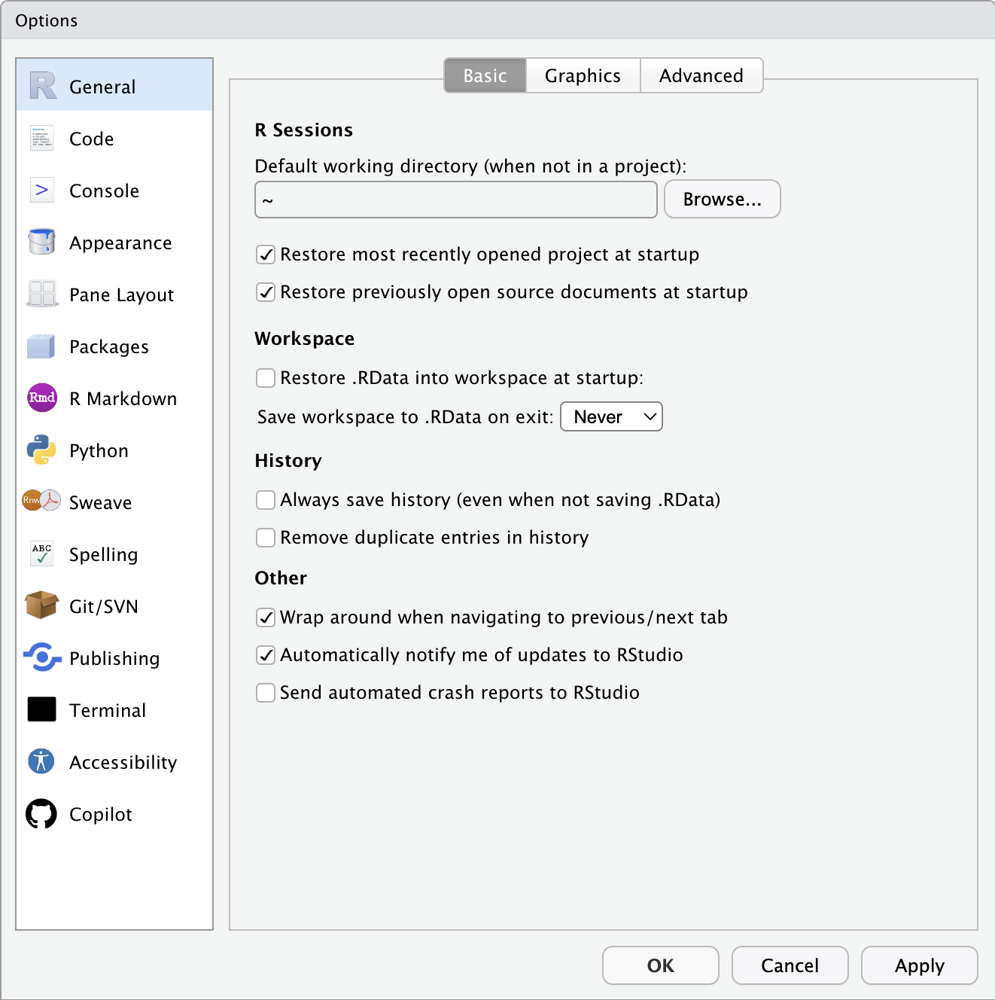
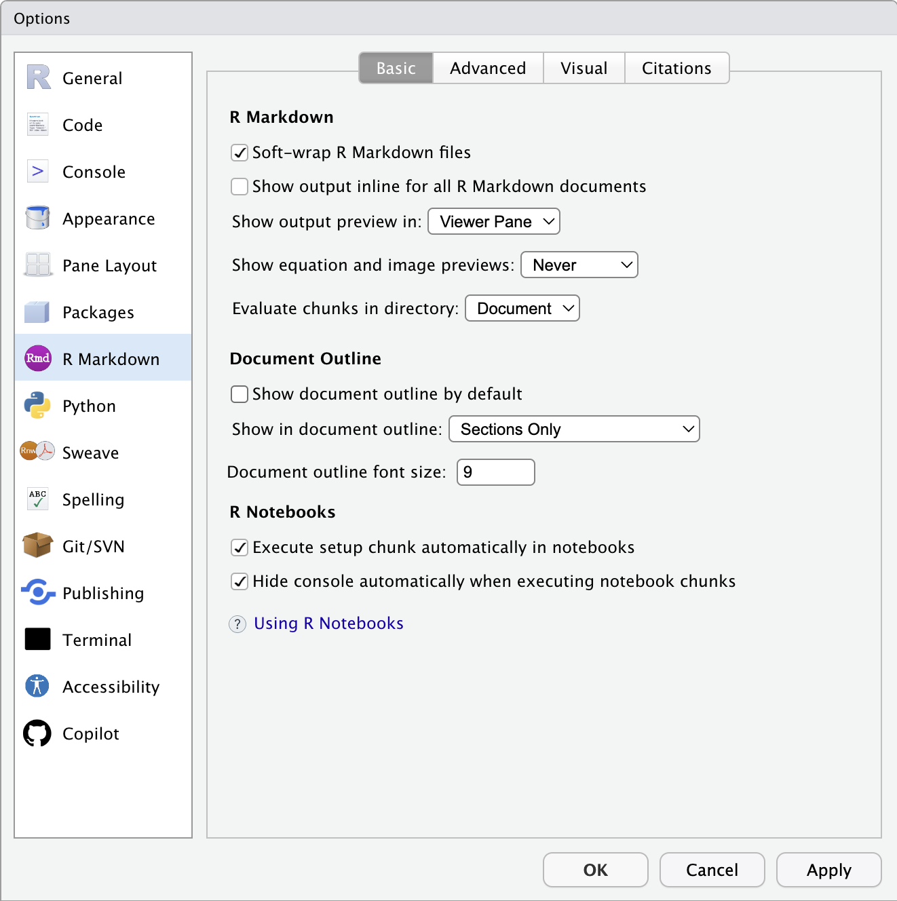

```{r setup, include=FALSE, eval=TRUE}
library(learnr)
```

## Introduction

Welcome to ENVX1002 tutorials. These tutorials are designed to complement your weekly computer laboratory sessions by providing practice exercises that introduce key concepts and techniques covered in the labs. 

Each tutorial aligns with the current week's laboratory material so you can work through examples with your lecturer.

**Tutorials are designed (mostly) as "live coding" sessions.** Your lecturer will guide you through a couple of exercises for you to follow along. Then, when you attend your laboratory, you will work through similar exercises with your demonstrators.

### This tutorial is a `learnr` tutorial

`learnr` is an *interactive* tutorial system that breaks down complex topics into manageable steps, helping you learn at your own pace. You can revisit sections as needed -- hopefully that helps you study better. For more information, see the `learnr` [website](https://rstudio.github.io/learnr/).

### Tutorial Objectives

In this tutorial, we will:

- Install R from CRAN
- Install RStudio Desktop
- Set up Posit Cloud (alternative to local installation)
- Configure RStudio settings for optimal use
- Create our first R project


## Installing R and RStudio

We will go through the installation process together. A useful site to start is the [RStudio download page](https://posit.co/download/rstudio-desktop/) as it conveniently contains links to access both R and RStudio Desktop.


Once you have installed R and RStudio, you should check that RStudio is working correctly. Some settings will also need to be adjusted. Let's go through this now.


### Session info

Open RStudio and type the following code into the console:

```{r eval=FALSE}
sessionInfo()
```

This will provide you with information about the versions of R and RStudio you are using. Make sure that it matches with the versions that you have installed.


### General options

We will go through this together but here are the settings that we will change:

1. In `General` -> `Workspace`: 
   - uncheck "Restore .RData into workspace at startup"
   - Set "Save workspace to .RData on exit" to "Never"
2. In `General` -> `History`: set "Save history" to "Never"

{width=80%}

### R Markdown options

3. In `R Markdown` -> `R Markdown`: 
   - check "Soft-wrap R Markdown files"
   - Set "Show output preview in" to "Viewer Pane"

{width=80%}

### More options

You may adjust the settings further, we will discuss this in the tutorial.

## Posit Cloud

{width=100%}

###

You may need to use Posit Cloud for a variety of reasons. In most cases it is because you are unable to install the latest version of R and RStudio on your computer, or you simply do *not* have a computer. In this case you can use Posit Cloud to access RStudio through any web browser -- using your tablet device or a university computer.

We will go through the process of setting up Posit Cloud together. This involves 

- signing up for an account
- navigating the interface, and 
- creating a new R project

Additionally, we will explore how to save your work and collaborate with others within Posit Cloud.

### Before you decide...

Posit Cloud was designed to be identical (well, almost) to RStudio Desktop. However, there are some limitations:

- You **must** have an internet connection
- Some advanced features are not available (but we do not use them in this unit anyway)
- There are complications surrounding file management -- you cannot access your local files directly unlike RStudio Desktop

If you really want to use Posit Cloud and need more help, please approach us in the laboratories and we will help you.


### Links

Some useful links:

- [Work with Data](https://docs.posit.co/cloud/guide/data/): some documentation on how to import and export data such as CSV files in Posit Cloud.
- [Code Projects](https://docs.posit.co/cloud/guide/projects/): information regarding managing your R projects in Posit Cloud.


## Creating an RStudio Project

RStudio projects help you organise your work by keeping all files for a project together in one directory. We will demonstrate how to create one live in class, but here are the key points to remember:

- Nothing changes in your R environment when you create a project, except for a `.Rproj` file in your project directory (a text file!)
- Projects keep all your files (data, scripts, outputs) organised in one place
- They make file paths relative and consistent
- They help with version control (which we'll cover later)
- **They make it easier to share your work** -- great for group projects

### To create a new R project

1. Click File > New Project
2. Choose either:
   - New Directory (for a fresh project)
   - Existing Directory (to turn current folder into a project)
3. Follow the setup wizard

We will create an example project together in class.

## Getting Started with R

Let's spend a few minutes getting familiar with basic R operations. We'll work through these examples together:

### Basic Calculations

Try these simple calculations in the R console:

```{r eval=FALSE}
# Addition
2 + 2

# Multiplication
3 * 4

# Division with decimals
10 / 3
```

### Variables

We can store values in variables:

```{r eval=FALSE}
# Store a number
x <- 5
y <- 10

# Use the variables
x + y

# Create a text variable
name <- "ENVX1002"
```

### Simple Functions

R has many built-in functions. Let's try some:

```{r eval=FALSE}
# Find the square root
sqrt(16)

# Round a number
round(3.14159, digits = 2)

# Subset a variable from a data frame
iris$Petal.Length

# Get help about a function
?sqrt
```

### Creating a Vector

Vectors are basic data structures in R:

```{r eval=FALSE}
# Create a numeric vector
numbers <- c(1, 2, 3, 4, 5)

# Calculate the mean
mean(numbers)

# Calculate the sum
sum(numbers)
```

Try these examples yourself as we go through them together. Remember, you can always get help by using `?` before a function name.

## Thanks

You have reached the end of this tutorial. We hope that this tutorial has helped you set up your RStudio environment and given you a taste of basic R operations. If you have any questions, jump onto Ed discussion board and ask away. See you next week!
